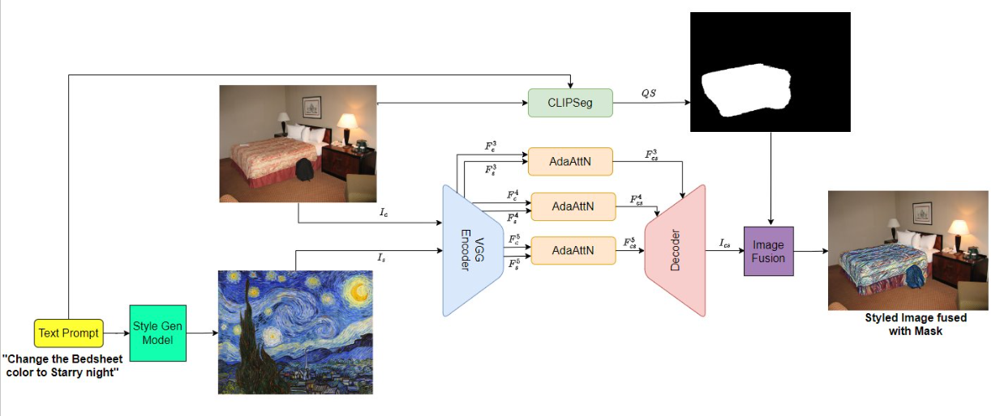

# Zero-shot_Semantic_NST

### *CS541: Deep Learning - [Worcester Polytechnic Institute](https://www.wpi.edu/), Fall 2023*
This repository is for "Zero-shot Semantic Neural Style Transfer for Images", course project for Deep Learning (CS541/Fall 2023).
The main objective of the project is to achieve Zero-Shot Style Transfer inspired by the paper AdaAttN: Revisit Attention Mechanism in Arbitrary Neural Style Transfer [Link](https://arxiv.org/abs/2108.03647)

The project explores the adaptability of AdaAttN in preserving semantic content while applying diverse styles to images. Traditional image segmentation methods are limited by their fixed set of object classes, requiring extensive retraining for new classes. Therefore, as an extension, a text-based image segmentation method is used that can generate segmentation based on arbitrary prompts. The text-based segmentation method is based on CLIPSeg [Link](https://arxiv.org/abs/2112.10003)

## Dependencies
The code base depends on pytorch, torchvision and clip
```bash
pip install git+https://github.com/openai/CLIP.git
```
Additional dependencies can be installed from requirements.txt 
```bash
pip install -r requirements.txt
```

## Dataset
The dataset used for training the model is the PhraseCut dataset [Link](https://github.com/ChenyunWu/PhraseCutDataset)

## Training and Evaluation
To train use train.py. Use the following command:

```bash
python train.py -b BATCH_SIZE -p NAME_OF_LOG_FILE -e EPOCHS -d PATH_TO_DATASET
```

Example:
```bash
python train.py -b 32 -p DEC12_2023 -e 50 -d dataset/PhraseCut
```

## Inference:
To use the pretrained models for inference, download the pretrained checkpoints from the following [link](https://drive.google.com/file/d/1L6Fj0wJ-onGvaMZFu24Jj5QQaJ3J6Goh/view?usp=sharing)

To perform style transfer on the entire image, use the following command:

```bash
python infer.py --content_path CONTENT_PATH --style_path STYLE_PATH --checkpoint_path PATH_TO_PRETRAINED_CHECKPOINTS --resize --keep_ratio
```

Example:

```bash
python infer.py --content_path data/content/c2.jpg --style_path data/style/wave.jpg --checkpoint_path ckpt/pretrained --resize --keep_ratio
```

### Stylized Image Example


To perform style transfer on a specific region of the image (semantic segmented mask) using the CLIPSeg Segmentation model, use the following command:

```bash
python clipseg_infer.py --content_path CONTENT_PATH --style_path STYLE_PATH --prompts PROMPTS
```

Example:

```bash
python clipseg_infer.py --content_path data/content/c3.jpg --style_path data/style/vg_starry_night.jpg --prompts "chair"
```

### Semantic Style Transfer Example


### Semantic Style Transfer Pipeline

